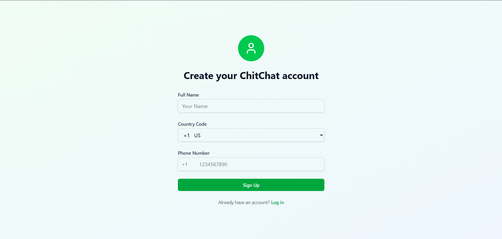
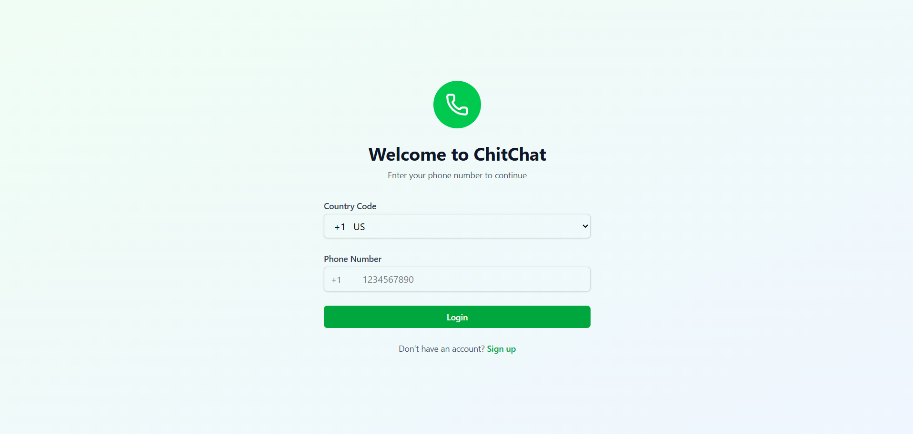
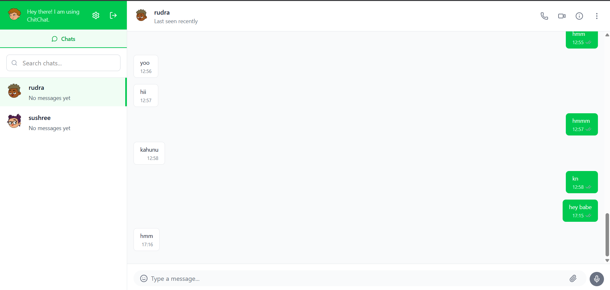
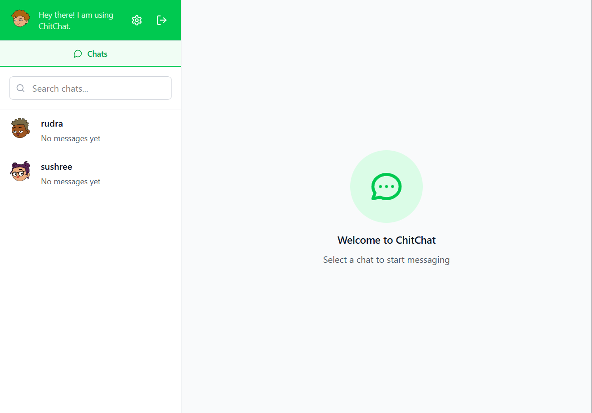
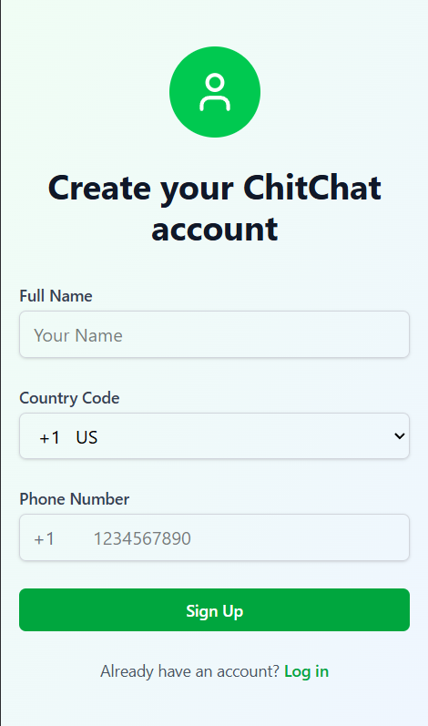
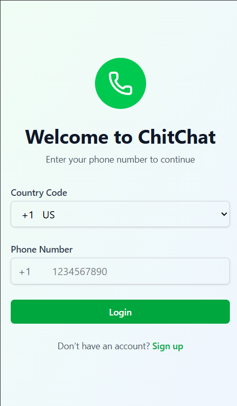
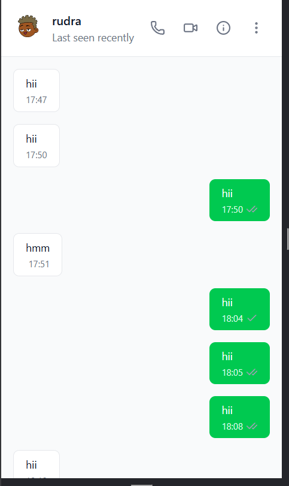
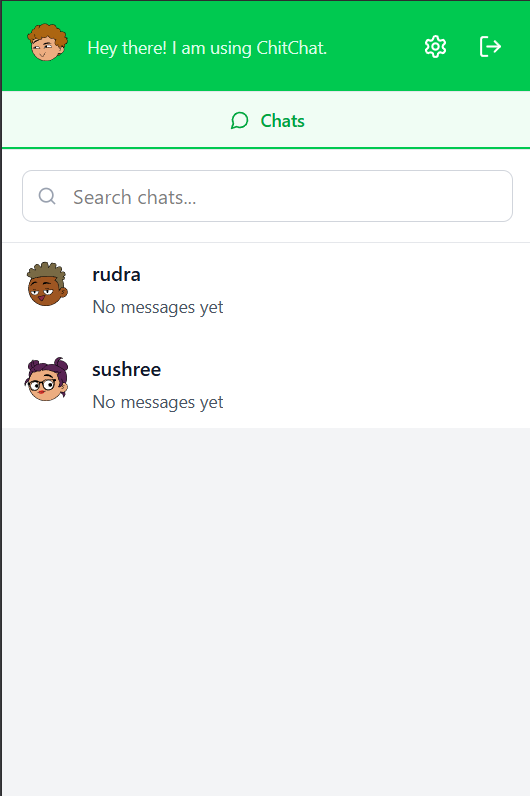

# ChitChat

ChitChat is a modern, full-stack chat application built with React, TypeScript, Express, MongoDB, and Redis. It supports real-time messaging, OTP-based authentication, contact management, and more.

## Features

- **Real-time one-to-one chat** (Socket.io)
- **OTP-based authentication** (phone number login/signup)
- **Contact management** (add, view contacts)
- **Message delivery/read status**
- **Online status indicator**
- **Responsive UI** (React + Vite + Tailwind)
- **Backend with Express, MongoDB, Redis**
- **SMS integration for OTP** (pluggable)

## Project Structure

```
chitchat/
├── apps/
│   ├── server/      # Express backend (API, Socket, Redis, MongoDB)
│   └── web/         # React frontend (Vite, TypeScript, Tailwind)
├── packages/
│   ├── ui/          # Shared UI components
│   ├── eslint-config/ # Shared lint config
│   └── typescript-config/ # Shared tsconfig
```

## Getting Started

### Prerequisites

- Node.js >= 18
- MongoDB
- Redis

### Backend Setup

1. Install dependencies:
   ```bash
   cd apps/server
   npm install
   ```
2. Configure environment variables in `.env`:
   - `MONGO_URI` (MongoDB connection string)
   - `REDIS_HOST`, `REDIS_PORT`, `REDIS_USERNAME`, `REDIS_PASSWORD`
   - `JWT_SECRET`, `REFRESH_SECRET`
   - SMS provider keys (if using real SMS)
3. Start the server:
   ```bash
   npm run dev
   ```

### Frontend Setup

1. Install dependencies:
   ```bash
   cd apps/web
   npm install
   ```
2. Configure `VITE_BE_URL` in `.env` to point to your backend URL.
3. Start the frontend:
   ```bash
   npm run dev
   ```

## Usage

1. **Sign up or log in** with your phone number.
2. **Receive OTP** via SMS (console log in dev).
3. **Verify OTP** to access chat features.
4. **Add contacts** by phone number.
5. **Start chatting** in real time!

## API Endpoints

- `POST /api/auth/send-otp` — Send OTP to phone number
- `POST /api/auth/verify-otp` — Verify OTP
- `POST /api/auth/signup` — Create account
- `POST /api/auth/login` — Login
- `GET /api/user/contacts` — Get contacts
- `POST /api/user/add-contact` — Add contact
- `GET /api/chats/:userId/messages` — Get chat messages

## Technologies

- **Frontend:** React, TypeScript, Vite, Tailwind CSS
- **Backend:** Express, MongoDB, Redis, Socket.io
- **Auth:** JWT, OTP (SMS)

## Development

- Lint: `npm run lint` (in each app)
- Format: `npm run format`
- Build: `npm run build`

## License

MIT

By default, Turborepo will cache locally. To enable Remote Caching you will need an account with Vercel. If you don't have an account you can [create one](https://vercel.com/signup?utm_source=turborepo-examples), then enter the following commands:

```
cd my-turborepo
npx turbo login
```

This will authenticate the Turborepo CLI with your [Vercel account](https://vercel.com/docs/concepts/personal-accounts/overview).

Next, you can link your Turborepo to your Remote Cache by running the following command from the root of your Turborepo:

```
npx turbo link
```

## Useful Links

Learn more about the power of Turborepo:

- [Tasks](https://turborepo.com/docs/crafting-your-repository/running-tasks)
- [Caching](https://turborepo.com/docs/crafting-your-repository/caching)
- [Remote Caching](https://turborepo.com/docs/core-concepts/remote-caching)
- [Filtering](https://turborepo.com/docs/crafting-your-repository/running-tasks#using-filters)
- [Configuration Options](https://turborepo.com/docs/reference/configuration)
- [CLI Usage](https://turborepo.com/docs/reference/command-line-reference)

## Demo

- Desktop

  
  
  
  

- Phone

  
  
  
  
